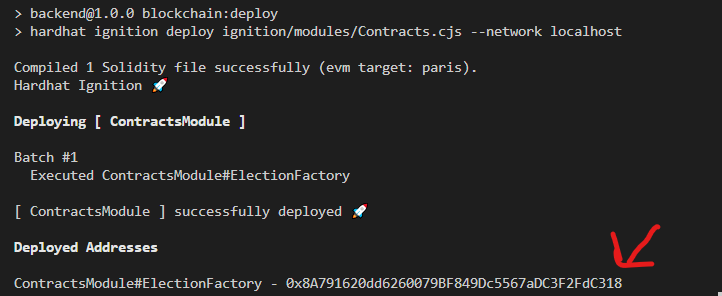

## How to start Blockchain dev server

1. install all of the project dependencies with `npm install`.
2. Start a blockchain network with command `npx hardhat node`. Upon running this command you see multiple accounts in this network. Use one of the private keys shown here as `PRIVATE_KEY` env variable.
   
3. Deploy the Smart Contract to blockchain network by running `npm run blockchain:deploy`. After running this command, you will see the contract address in the terminal. Please, copy and paste it into the related CONTACT_ADDRESS env variable.
   
   
4. If you make changes in the smart contract code, you can redeploy them with `npm run blockchain:redeploy`. After running this command, make sure to copy and paste the new contract address in .env file.
